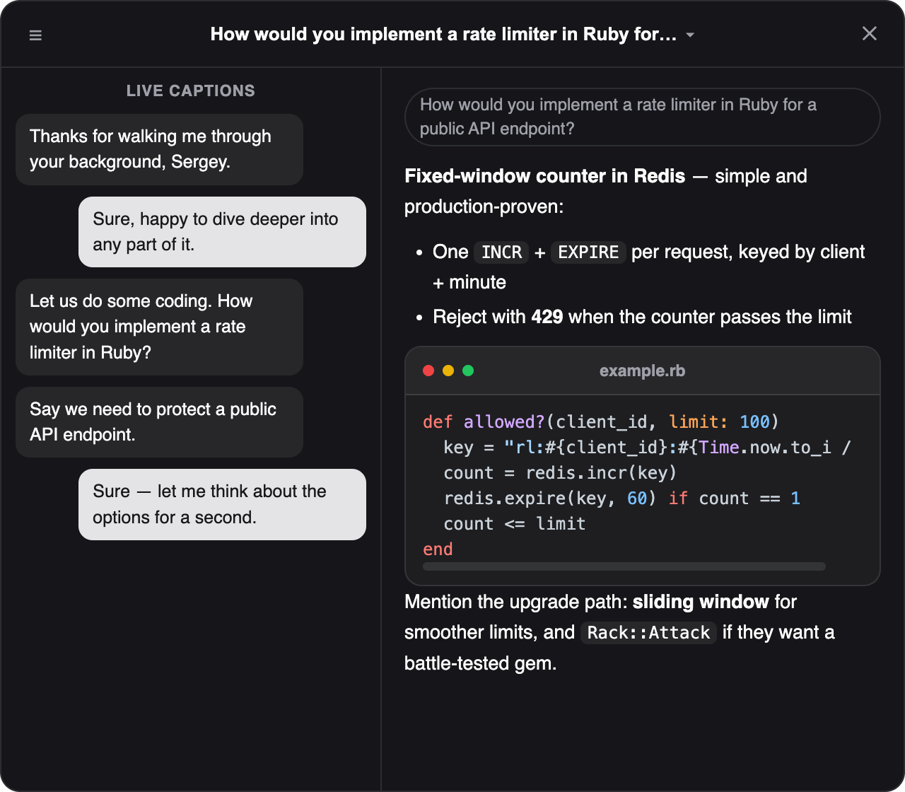

<p align="center">
  
</p>

<h1 align="center">NerdSidekiq</h1>

<p align="center"><b>Your interview copilot — three modes in one floating window.</b><br>
Records both sides of the call, transcribes locally, and streams live answers
from your own Claude account — or plays the interviewer and coaches you before
the real thing.</p>

<p align="center">
  
  
  
</p>

<p align="center">
  
</p>

## Three modes

The overlay **is** the app: one dark, always-on-top window with three
full-size mode cards. No Dock icon, no extra windows — ⚙ opens Settings,
✕ quits. Pick a mode on the start screen:

| Mode | What it does |
|---|---|
| 📝 **Interview Transcript** | Start / end an interview and watch live captions of both sides. A full transcript and an AI-titled summary are saved when you finish. |
| 🦸 **Interview Sidekiq** | Live captions **plus** helpful tips: interviewer questions are detected automatically and strong talking-point answers stream in beside them. No hotkeys. |
| 🎓 **Interview Preparation** | A mock interview. Tell the AI what the interview is about (and optionally point it at a notes file — common questions, your CV). It plays the interviewer: prints questions, listens to your spoken answers, detects when you stop talking (~5 s pause, asks if unsure), coaches you on what to improve, and has you recite a stronger answer before moving on. |

The call name is generated automatically — the AI titles the note from the
transcript (e.g. "Yandex HR — backend screen"). No fields to fill before a call.

## Features

- 🎧 **Hears both sides** — your mic and the call audio (Zoom, Meet, anything), via a Core Audio process tap. Your audio devices are never touched.
- 📝 **Local transcription** — whisper.cpp on-device, free and private. Audio never leaves your Mac.
- 🤖 **Automatic live answers** — questions are detected as they are asked; the answer streams into the overlay with live captions and syntax-highlighted code.
- 🎓 **Mock interviews** — AI interviewer + coach with pause detection, per-answer feedback, and a "recite the improved answer" round. Practice sessions stay local.
- 🧠 **Your own Claude** — one-time OAuth to your Claude account, pick any model per task. No API keys to manage.
- 📁 **Transcripts where you want them** — one folder per call: audio, transcript, AI summary with an AI-generated title.
- 🧭 **First-run wizard** — permissions, Claude authorization, models, folders. Two minutes and you are set.

## Install

1. Grab **`NerdSidekiq.dmg`** from [Releases](../../releases) and drag the app into Applications.
2. Install the two local dependencies:
   ```sh
   brew install whisper-cpp ffmpeg anthropics/tap/ant
   ```
3. Open the app — the setup wizard walks you through microphone + system-audio permissions, Claude authorization (browser, one click), model choice, and your transcript folder.

## Usage

1. Open the app — the floating overlay appears with the three mode cards.
2. **Real interview:** pick *Transcript* or *Sidekiq* before the meeting. Talk; captions (and answers, in Sidekiq mode) appear automatically. Click **End** — you get a titled transcript + summary in your transcript folder (and Notion, if configured).
3. **Practice:** pick *Preparation*, describe the interview, optionally give a notes-file path, and answer the AI interviewer out loud. Pause ~5 seconds when you finish an answer. The dialogue is saved to `prep_transcript.txt` in the session folder.

Settings (the ⚙ button on the start screen) let you change models (e.g. a
cheaper model for the rolling summary), the transcript folder, and permissions.

> Note: after every rebuild of the app, macOS asks again for the
> System Audio Recording permission on the first session — click Allow once.

## Build from source

```sh
git clone https://github.com/sergey-yakushevich/nerdsidekiq
cd nerdsidekiq
python3 -m venv .venv && .venv/bin/pip install anthropic
cd overlay && npm install && cd ..
./build.sh          # → build/NerdSidekiq.app
./make-dmg.sh       # → dist/NerdSidekiq.dmg (optional installer)
```

`./demo.sh en` runs a full self-test with a synthetic voice.

## How it works

Swift app (audio capture, process control) → Python loops
(`live_loop.py` for real calls, `prep_loop.py` for mock interviews;
whisper.cpp transcription, Claude via the Anthropic SDK) → Electron overlay
(the whole UI: mode picker, captions, streamed answers, coaching).

The overlay controls the recorder: picking a mode writes `session.json` and
posts a darwin notification (`notifyutil -p dev.cyberjosef.nerdsidekiq.start` /
`.finish` also work headlessly, for scripting). Claude usage bills to your own
account; transcription costs nothing.

## License

MIT — free and open source. Use it, fork it, land the job.
